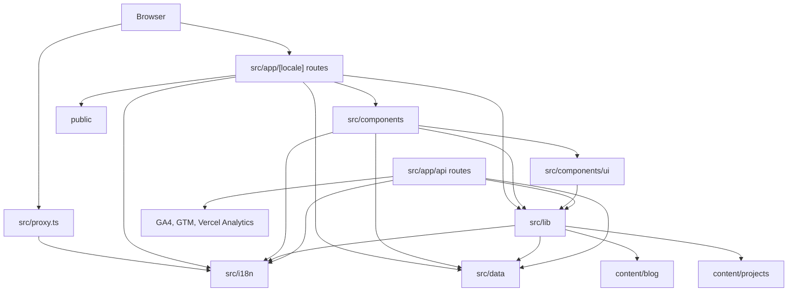

# Architecture

> Last regenerated: 2026-05-07
> Source analysis: `package.json`, `next.config.ts`, `src/app/`, `src/components/`, `src/i18n/`, `src/lib/`, `src/data/`, `content/blog/`, `content/projects/`

## 1 Overview

This repository is a Next.js 16 App Router portfolio, blog, and project case study application with TypeScript, Tailwind CSS 4, React 19, `next-intl`, MDX-backed long-form content, JSON-LD/SEO helpers, and optional analytics integrations. The public site is composed from locale-aware routes, shared React components, structured JSON message files, static assets, and filesystem-backed blog and project content.

> Sources: `package.json:15-84`, `next.config.ts:1-24`, `src/app/[locale]/layout.tsx:1-92`, `src/lib/blog.ts`, `src/lib/projects.ts`

## 2 System Architecture

### 2.1 Package Dependency Graph

> Sources: `src/proxy.ts:1-10`, `src/app/[locale]/page.tsx`, `src/app/[locale]/layout.tsx:1-92`, `src/app/[locale]/projects/[slug]/layout.tsx`, `src/app/api/feed/atom.xml/route.ts:1-16`, `src/app/api/analytics/route.ts:5-15`

### 2.2 Layer Hierarchy

| Layer         | Paths                           | May import                                                  | Must not import                                    |
| ------------- | ------------------------------- | ----------------------------------------------------------- | -------------------------------------------------- |
| L0 Data       | `src/data/`                     | External packages only                                      | `src/app`, `src/components`, `src/i18n`, `src/lib` |
| L1 I18n       | `src/i18n/`                     | `src/data`, `src/i18n`                                      | `src/app`, `src/components`, `src/lib`             |
| L2 Lib        | `src/lib/`                      | `src/data`, `src/i18n`, special case `src/components/icons` | `src/app`, general `src/components`                |
| L3 Components | `src/components/`               | `src/components`, `src/data`, `src/i18n`, `src/lib`         | `src/app`                                          |
| L4 App        | `src/app/`, `src/proxy.ts`      | L0-L3, framework packages                                   | N/A                                                |
| L4 API        | `src/app/api/`                  | `src/data`, `src/i18n`, `src/lib`                           | React component modules                            |

> Enforced by: `scripts/lint-deps.mjs`

### 2.3 Current Architectural Exception

`src/lib/utils.tsx` and `src/lib/social-icons.tsx` import `@/components/icons` to map JSON-configured icon names to React icon components. This is intentional in the current architecture and is the only allowed `src/lib` to `src/components` dependency.

> Sources: `src/lib/utils.tsx:1-5`, `src/lib/utils.tsx:55-66`, `src/lib/social-icons.tsx:1-17`, `src/components/icons.tsx:1-24`

## 3 Runtime Flow

### 3.1 Locale Routing

Incoming non-API requests pass through `src/proxy.ts`, which delegates to `next-intl` proxy logic using the routing contract from `src/i18n/routing.ts`. The app supports `en` and `zh` with an `as-needed` locale prefix.

> Sources: `src/proxy.ts:1-10`, `src/i18n/routing.ts:1-24`

### 3.2 Request Message Loading

`src/i18n/request.ts` validates the requested locale, falls back to the default locale, then dynamically imports `common.json`, `personal.json`, and `collections.json` for that locale. Layout and page components use `getMessages`, `getTranslations`, and `NextIntlClientProvider` to share those messages with client components.

> Sources: `src/i18n/request.ts:5-31`, `src/app/[locale]/layout.tsx:4-9`, `src/app/[locale]/layout.tsx:58-91`

### 3.3 Portfolio Page Composition

The home page reads translated structured data, converts social icon keys into React components, generates Person JSON-LD, and composes section components for profile, projects, publications, education, work, awards, talks, skills, services, and contact. Project previews now read summary data directly from project MDX frontmatter through `src/lib/projects.ts`, and route into localized project case study pages by slug.

> Sources: `src/app/[locale]/page.tsx`, `src/lib/projects.ts`

### 3.4 Blog Content Flow

Blog posts live in locale-specific directories under `content/blog`. `src/lib/blog.ts` reads MDX files from the filesystem, parses frontmatter with `gray-matter`, converts Markdown to HTML through `unified`, applies the shared content-image transformer from `src/lib/content-images.ts`, computes reading time by locale, and returns typed post objects to pages, sitemap, and feed routes.

> Sources: `src/lib/blog.ts`, `src/app/api/feed/atom.xml/route.ts:88-117`

### 3.5 Project Content Flow

Project case studies live in locale-specific directories under `content/projects`. `src/lib/projects.ts` reads MDX files from the filesystem, parses typed frontmatter for both summary and full-detail use cases, converts Markdown to HTML through the shared Markdown pipeline, applies the shared content-image transformer from `src/lib/content-images.ts`, and returns typed project objects to the homepage, portfolio archive route, localized detail routes, and the sitemap.

> Sources: `src/lib/projects.ts`, `src/app/[locale]/projects/[slug]/layout.tsx`, `src/app/[locale]/projects/[slug]/page.tsx`, `src/app/sitemap.ts`

### 3.6 SEO and Metadata

SEO metadata and JSON-LD are centralized in helper modules and consumed by layouts, pages, sitemap, robots, Open Graph image routes, and feed routes.

> Sources: `src/app/[locale]/layout.tsx:1-92`, `src/app/[locale]/projects/[slug]/layout.tsx`, `src/app/sitemap.ts`, `src/app/robots.ts:3`, `src/lib/jsonld.tsx`, `src/lib/metadata.ts`

### 3.7 Analytics Flow

The GA4 analytics endpoint reads `GA4_PROPERTY_ID`, `GA4_CLIENT_EMAIL`, and `GA4_PRIVATE_KEY` server-side, returns a 500 response when credentials are missing, and queries GA4 for total sessions or page views. Client-side GTM and Vercel analytics are only injected outside development.

> Sources: `src/app/api/analytics/route.ts:13-24`, `src/app/api/analytics/route.ts:31-48`, `src/app/api/analytics/route.ts:50-115`, `src/app/[locale]/layout.tsx:93-106`

## 4 Generated Harness

The harness adds documentation, dependency checks, quality checks, runtime environment metadata, and CI glue without changing application behavior.

| File                              | Purpose                                               |
| --------------------------------- | ----------------------------------------------------- |
| `AGENTS.md`                       | Agent navigation map                                  |
| `docs/`                           | Architecture, development, quality, design docs       |
| `scripts/lint-deps.mjs`           | Mechanical dependency boundary checks                 |
| `scripts/lint-quality.mjs`        | Documentation, i18n, and content consistency checks   |
| `harness/config/environment.json` | Runtime and env contract for future harness executors |
| `.github/workflows/harness.yml`   | CI checks for lint, build, and harness verification   |

> Sources: `AGENTS.md`, `scripts/lint-deps.mjs`, `scripts/lint-quality.mjs`, `harness/config/environment.json`
